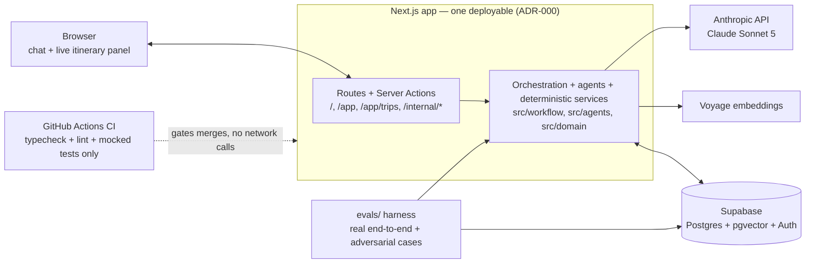
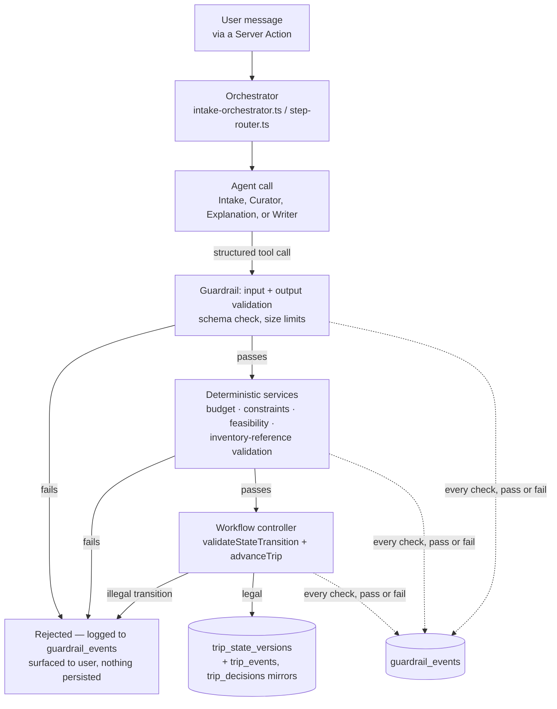

# Architecture Diagram

Companion to `docs/architecture/ADR-INDEX.md` — two views of the one Next.js app (`ADR-000`): where each major component sits, and how a single chat turn flows through the deterministic-vs-agent split (`PROJECT_BRIEF.md` §6.1). Rendered automatically by GitHub; any Mermaid-compatible viewer works elsewhere.

## 1. System components

## 2. One chat turn — the deterministic-vs-agent split

What happens inside `Workflow` above for a single user message (e.g. "make it cheaper"), per `PROJECT_BRIEF.md` Operating Principle #1: correctness belongs to deterministic code; models interpret, rank, explain, and write.

## Reading these diagrams

- **One box, one deployable.** Everything in diagram 1's `App` subgraph is one codebase, one process — no separate orchestration service or agent-framework runtime to operate (`ADR-000`).
- **Agents never touch the database directly.** In diagram 2, every agent's output passes through guardrails and (where relevant) deterministic services before the workflow controller decides whether anything gets persisted — only `controller.ts` ever writes `trip_state_versions`.
- **Every guardrail check is logged, not just failures.** The dotted arrows into `guardrail_events` fire on a pass just as much as a fail — that symmetry is what makes the engineering dashboard's "guardrail trigger frequency" panel a real signal (`ADR-007`) rather than an error log.
- **The eval harness is a second, real caller of the same code**, not a mocked shadow of it — it calls the actual orchestrator functions with real API calls (`ADR-006`), which is why its results land in the same tables the dashboards read. It stays out of the CI-gating path, which is deliberately mocked and network-free.
- **Telemetry tables are invisible to the product.** `agent_runs`/`tool_calls`/`guardrail_events`/`eval_runs`/etc. have no RLS policy for `anon`/`authenticated` — only server-side code using the service role (orchestrators, dashboards, the eval harness) can reach them, and `tool_calls` payloads are redacted at that same write boundary before landing here (`ADR-007`).

## What would change for live providers or real booking

Per `PROJECT_BRIEF.md` §21's required narrative point — this is exactly where the diagram would change:

- The seeded/mock inventory behind `Deterministic`'s services would become a live cache or pass-through in front of real supplier APIs, with the same `inventory_version`/freshness fields doing double duty as a staleness check against real-time availability.
- `Deterministic` itself would not need to change shape — it already treats inventory as an opaque, versioned candidate set, not something it generates.
- A new boundary would appear after `Controller` in diagram 2, toward an actual booking/payment provider, with its own explicit-approval gate mirroring `approval_records`' existing "what was proposed vs. what was approved" model. No such arrow exists today — booking execution is explicitly out of scope for v1 (`PROJECT_BRIEF.md` §3.2).
